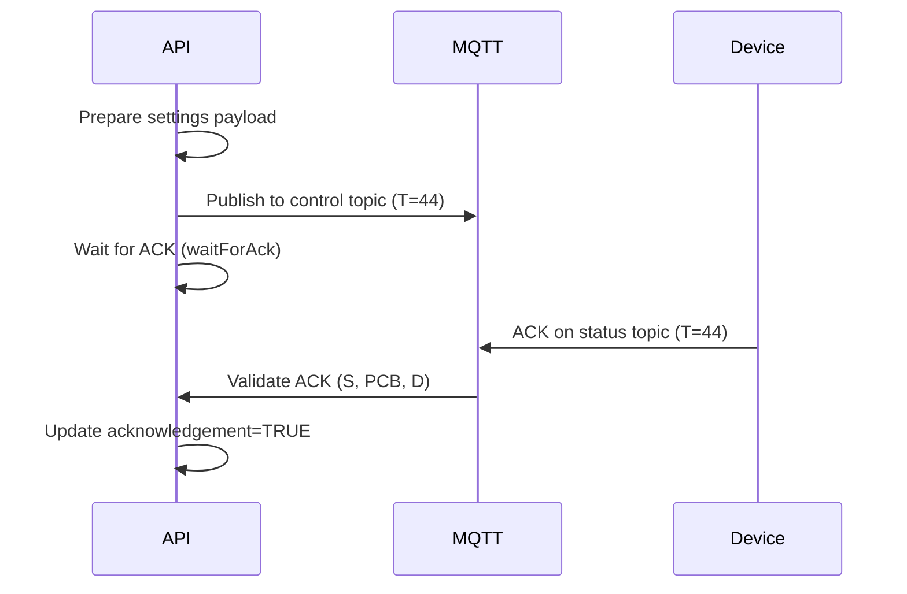

# iDhara Single Motor Starter - Complete Project Understanding

## 🎯 Project Overview

**iDhara** is a comprehensive IoT-based single motor starter management system that enables remote monitoring and control of agricultural motors through a cloud-connected platform. The system consists of a backend API (this project), mobile applications, and IoT hardware devices.

### Core Purpose
- Remote motor control and monitoring for agricultural applications
- Real-time device telemetry and analytics
- Multi-user management with admin and user roles
- MQTT-based device communication
- Settings configuration and fault management

---

## 🏗️ Architecture

### Technology Stack

| Component | Technology |
|-----------|-----------|
| **Runtime** | Node.js with TypeScript |
| **Framework** | Hono (lightweight web framework) |
| **Database** | PostgreSQL with Drizzle ORM |
| **Real-time Communication** | MQTT (EMQX broker) |
| **Validation** | Valibot |
| **Authentication** | JWT + Argon2 password hashing |
| **SMS/OTP** | MSG91 integration |
| **Date Handling** | moment, moment-timezone, date-fns |

### Project Structure

```
src/
├── app.ts                    # Application setup with middleware
├── index.ts                  # Entry point, server initialization
├── config/                   # Configuration files
│   ├── app-config.ts
│   ├── db-config.ts
│   ├── jwt-config.ts
│   ├── mqtt-config.ts
│   └── sms-config.ts
├── constants/                # Application constants and enums
├── database/
│   ├── configuration.ts      # Database connection
│   └── schemas/              # Drizzle ORM schemas (17 tables)
├── routes/                   # API route definitions
├── handlers/                 # Request handlers (business logic)
├── services/
│   ├── mqtt-service.ts       # MQTT client management
│   └── db/                   # Database service layer
├── helpers/                  # Utility functions
├── middlewares/              # Custom middleware
├── validations/              # Request validation schemas
├── exceptions/               # Custom exception classes
├── types/                    # TypeScript type definitions
└── utils/                    # General utilities
```

---

## 📊 Database Schema

### Core Entities

#### 1. **Users** (`users`)
- User management with role-based access (ADMIN/USER)
- Fields: full_name, email, phone, user_type, password, address, status
- Self-referencing for created_by and referred_by
- Notification preferences stored as JSONB

#### 2. **Locations** (`locations`)
- Organizational units for grouping devices
- Belongs to a user, can have multiple motors
- Unique constraint: location name per user

#### 3. **Starter Boxes** (`starter_boxes`)
- Physical IoT devices that control motors
- Device Status: ASSIGNED, DEPLOYED, READY, TEST
- Starter Type: SINGLE_STARTER, MULTI_STARTER
- Key fields:
  - `name`, `alias_name`, `mac_address`, `pcb_number`, `starter_number`
  - `power` (0/1 for OFF/ON)
  - `signal_quality`, `network_type`
  - References: user_id, location_id, gateway_id

#### 4. **Motors** (`motors`)
- Actual motors controlled by starter boxes
- Fields: name, alias_name, hp (horsepower)
- `state`: 0 (OFF) / 1 (ON)
- `mode`: MANUAL / AUTO
- References: starter_id, location_id, created_by

#### 5. **Starter Settings** (`starter_settings`)
- Comprehensive device configuration
- Categories:
  - **Device Config** (`dvc_cnfg`): Fault/alert/recovery thresholds
  - **Motor Config** (`mtr_cnfg`): Motor-specific settings
  - **Atmel Calibration** (`atml_cnfg`): Voltage/current calibration
  - **MQTT Config** (`mqt_cnfg`): Broker settings
  - **IVRS Config** (`ivrs_cnfg`): SMS/call settings
  - **Frequency Config** (`frq_cnfg`): Live data frequencies
  - **Feature Enables** (`feats_en`): Feature toggles
  - **Fault Enables** (`flt_en`): Individual fault toggles
- `acknowledgement`: TRUE/FALSE (device ACK status)
- `is_new_configuration_saved`: Flag for pending changes

#### 6. **Starter Default Settings** (`starter_default_settings`)
- Template settings for new devices

#### 7. **Starter Settings Limits** (`starter_settings_limits`)
- Min/max validation ranges for all settings

#### 8. **Motor Schedules** (`motor_schedules`)
- Automated scheduling for motors

#### 9. **Device Runtime** (`device_runtime`)
- Tracks device power ON/OFF periods

#### 10. **Motor Runtime** (`motor_runtime`)
- Tracks motor operation periods

#### 11. **Alerts & Faults** (`alerts_faults`)
- Historical fault/alert records

#### 12. **Starter Parameters** (`starter_parameters`)
- Real-time telemetry data from devices

#### 13. **Fields** (`fields`)
- Agricultural field management

#### 14. **Gateways** (`gateways`)
- Network gateway devices

#### 15. **OTP** (`otp`)
- One-time password management

#### 16. **User Activity Logs** (`user_activity_logs`)
- Audit trail

#### 17. **Device Tokens** (`device_tokens`)
- Mobile app push notification tokens

---

## 🔄 MQTT Communication

### Topic Structure

```
peepul/{mac_address}/control    # Cloud → Device (commands)
peepul/{mac_address}/status     # Device → Cloud (ACKs)
peepul/{mac_address}/live       # Device → Cloud (telemetry)
```

### Message Types (T field)

| Type | Description | Direction |
|------|-------------|-----------|
| 11 | Motor Control | Cloud → Device |
| 22 | Motor Mode Change | Cloud → Device |
| 33 | Heartbeat | Device → Cloud |
| 44 | Settings Publish | Cloud → Device |
| 55 | Admin Config Request | Cloud → Device |
| 66 | Live Data | Device → Cloud |

### MQTT Service ([mqtt-service.ts](file:///d:/orotron/Single-motor-Starter/peepulagri-api.single-motor-starter/src/services/mqtt-service.ts))
- Singleton instance: `mqttServiceInstance`
- Auto-reconnect with QoS 1
- Subscribes to `peepul/+/status` on connect
- Routes messages to appropriate handlers via [selectTopicAck()](file:///d:/orotron/Single-motor-Starter/peepulagri-api.single-motor-starter/src/services/db/mqtt-db-services.ts#38-65)

### Key MQTT Handlers ([mqtt-db-services.ts](file:///d:/orotron/Single-motor-Starter/peepulagri-api.single-motor-starter/src/services/db/mqtt-db-services.ts))

1. **[motorControlAckHandler](file:///d:/orotron/Single-motor-Starter/peepulagri-api.single-motor-starter/src/services/db/mqtt-db-services.ts#156-190)** - Handles motor ON/OFF ACKs
2. **[motorModeChangeAckHandler](file:///d:/orotron/Single-motor-Starter/peepulagri-api.single-motor-starter/src/services/db/mqtt-db-services.ts#192-208)** - Handles AUTO/MANUAL mode ACKs
3. **[heartbeatHandler](file:///d:/orotron/Single-motor-Starter/peepulagri-api.single-motor-starter/src/services/db/mqtt-db-services.ts#210-226)** - Processes device heartbeats
4. **[adminConfigDataRequestAckHandler](file:///d:/orotron/Single-motor-Starter/peepulagri-api.single-motor-starter/src/services/db/mqtt-db-services.ts#233-252)** - Handles settings ACKs
5. **[saveLiveDataTopic](file:///d:/orotron/Single-motor-Starter/peepulagri-api.single-motor-starter/src/services/db/mqtt-db-services.ts#16-37)** - Processes live telemetry data

### Settings Publish Flow



**Retry Logic** (from conversation history):
- Uses [waitForAck()](file:///d:/orotron/Single-motor-Starter/peepulagri-api.single-motor-starter/src/services/db/mqtt-db-services.ts#253-317) with configurable timeout
- Validates ACK: message type (T=44), sequence number (S), PCB number
- Stops immediately on valid ACK
- No database update on failure (only logging)

---

## 🛣️ API Routes

### Base URL: `/v1`

| Route | Purpose |
|-------|---------|
| `/auth` | Authentication (login, OTP) |
| `/users` | User management |
| `/locations` | Location CRUD |
| `/fields` | Field management |
| `/motors` | Motor CRUD and control |
| `/starters` | Starter device management |
| `/motor-schedules` | Schedule management |
| `/settings` | Device settings |
| `/users-activities` | Activity logs |

### Key Endpoints (Examples)

**Starters** (`starter-routes.ts`):
- `POST /` - Add new starter
- `GET /` - List starters (paginated)
- `POST /assign` - Assign starter to user
- `PUT /:id` - Update starter
- `DELETE /:id` - Delete/archive starter
- `GET /:id/analytics` - Get analytics data
- `GET /:id/runtime` - Get runtime statistics

**Motors** (`motor-routes.ts`):
- Motor control endpoints
- Mode switching (AUTO/MANUAL)
- State management

**Settings** (`settings-routes.ts`):
- Get/update device settings
- Publish settings to device via MQTT

---

## 🔐 Authentication & Authorization

### Authentication Methods

1. **Email + Password** (Admin)
   - Argon2 password hashing
   - JWT token generation

2. **Mobile + OTP** (User)
   - MSG91 SMS integration
   - OTP validation

### Middleware
- JWT verification middleware
- User payload injection into context

---

## 📡 Device Lifecycle

### 1. Device Creation (Admin)
```
Admin → Create Starter Box
  ├─ Required: starter_number (serial number)
  └─ Optional: name, mac_address, pcb_number
  
Status: READY
```

### 2. Device Assignment (User via Mobile)
```
User → Request Assignment (PCB/Serial + User ID)
  ├─ Validation:
  │   ├─ Device exists?
  │   ├─ User exists?
  │   ├─ Already assigned?
  │   └─ device_status = DEPLOYED?
  └─ Success → Link device to user
  
Status: ASSIGNED
```

### 3. Device Operation
```
Device → Connect to MQTT
  ├─ Publish heartbeats (T=33)
  ├─ Publish live data (T=66)
  └─ Respond to commands with ACKs
```

---

## 📈 Analytics & Monitoring

### Runtime Tracking

**Device Runtime** (`trackDeviceRunTime`):
- Tracks when device power state changes
- Records start/end timestamps
- Calculates total runtime

**Motor Runtime** (`trackMotorRunTime`):
- Similar to device runtime
- Specific to motor state changes

### Analytics Queries (`getStarterAnalytics`)
- Time-series data for specific parameters
- Date range filtering
- Motor-specific or device-wide

---

## 🔧 Key Helper Functions

### MQTT Helpers (`mqtt-helpers.ts`)

- **`randomSequenceNumber()`** - Generates unique sequence numbers (1-255)
- **`mapFlatToCategoryPayload()`** - Converts flat settings to categorized structure
- **`buildCategoryPayloadFromFlat()`** - Builds partial update payloads
- **`publishWithRetry()`** - Retry mechanism for MQTT publishes

### Settings Helpers (`settings-helpers.ts`)

- **`prepareSettingsData()`** - Formats settings for device consumption
- Validates against limits
- Handles nested configuration objects

### Validation Helpers (`payload-validate-helpers.ts`)

- Validates incoming MQTT payloads
- Schema validation for live data
- ACK validation

---

## 🚨 Fault & Alert Management

### Fault Types

**Device Faults**:
- IPF (Input Phase Failure)
- LVF (Low Voltage Fault)
- HVF (High Voltage Fault)
- VIF (Voltage Imbalance Fault)
- PAMINF/PAMAXF (Phase Angle faults)

**Motor Faults**:
- DR (Dry Run)
- OL (Overload)
- LR (Low Running)
- OPF (Open Phase Fault)
- CI (Current Imbalance)

### Fault Handling
- Each fault has enable/disable flag
- Configurable thresholds (fault, alert, recovery)
- Stored in `alerts_faults` table
- Real-time notifications

---

## 🔍 Recent Work (from Conversation History)

### 1. **Type Safety Improvements**
- Removed all `any` and `unknown` types
- Defined precise types based on database schemas
- Enhanced type safety across codebase

### 2. **Code Quality**
- Removed unused imports
- Improved maintainability

### 3. **Settings Publish Refinement**
- Fixed ACK validation logic
- Ensured retries stop on valid ACK
- Stricter validation for ACK payload (T=44, S, PCB, D=0/1)
- Removed database updates on failure
- Restored necessary service functions

---

## 🎨 Data Flow Examples

### Motor Control Flow

```
Mobile App → API Handler
  ↓
Validate Request
  ↓
Build MQTT Payload (T=11, S=random, D=0/1)
  ↓
Publish to peepul/{mac}/control
  ↓
Wait for ACK (timeout: 5s)
  ↓
Device → Publish ACK to peepul/{mac}/status
  ↓
Validate ACK (T, S, PCB match)
  ↓
Update Motor State in DB
  ↓
Return Success to Mobile
```

### Live Data Flow

```
Device → Publish to peepul/{mac}/live (T=66)
  ↓
MQTT Service receives message
  ↓
liveDataHandler()
  ├─ Extract MAC from topic
  ├─ Validate MAC in DB
  ├─ validateLiveDataFormat()
  ├─ validateLiveDataContent()
  └─ prepareLiveDataPayload()
  ↓
saveLiveDataTopic()
  ├─ Update starter_parameters
  ├─ Track runtime changes
  └─ Update device/motor states
```

---

## 🔑 Key Design Patterns

### 1. **Service Layer Pattern**
- Handlers → Services → Database
- Separation of concerns
- Reusable business logic

### 2. **Transaction Management**
- Complex operations wrapped in DB transactions
- Rollback on failure
- Examples: `assignStarterWithTransaction`, `replaceStarterWithTransaction`

### 3. **Validation Pipeline**
- Request validation (Valibot schemas)
- Business logic validation
- Database constraint validation

### 4. **Error Handling**
- Custom exception classes
- Centralized error handler (`onError`)
- Structured error responses

### 5. **Pagination**
- Offset-based pagination
- Configurable page size
- Total count included

---

## 🌐 Environment Variables

```env
API_VERSION=v1
PORT=3000

# Database
DB_HOST=
DB_USER=
DB_PASSWORD=
DB_NAME=
DB_PORT=5432

# JWT
JWT_SECRET=

# MQTT/EMQX
EMQX_API_KEY=
EMQX_USERNAME=
EMQX_PASSWORD=
EMQX_CLIENT_ID=

# SMS
MSG91_SMS_API_KEY=
MSG91_SMS_TEMPLATE_ID=
```

---

## 📦 Dependencies

### Production
- `@hono/node-server` - HTTP server
- `hono` - Web framework
- `drizzle-orm` - ORM
- `pg` - PostgreSQL client
- `mqtt` - MQTT client
- `argon2` - Password hashing
- `valibot` - Schema validation
- `axios` - HTTP client
- `moment`, `moment-timezone`, `date-fns` - Date handling
- `dotenv` - Environment variables

### Development
- `typescript` - Type checking
- `tsx` - TypeScript execution
- `drizzle-kit` - Database migrations

---

## 🚀 Scripts

```json
{
  "dev": "tsx watch src/index.ts",
  "build": "tsc",
  "start": "node dist/src/index.js",
  "db:gen": "npm run build && drizzle-kit generate",
  "db:apply": "npx drizzle-kit migrate",
  "db:studio": "npx drizzle-kit studio"
}
```

---

## 🎯 Business Logic Highlights

### Starter Assignment Validation
```typescript
// Device must exist
// User must exist
// Device must not be already assigned
// Device status must be DEPLOYED
// Creates motor with default name if not provided
```

### Settings Update Flow
```typescript
// 1. Fetch current settings
// 2. Validate new settings against limits
// 3. Merge with existing settings
// 4. Save to database
// 5. Prepare MQTT payload
// 6. Publish with retry logic
// 7. Wait for ACK
// 8. Update acknowledgement status
```

### Runtime Tracking Logic
```typescript
// On power/state change:
// 1. Check previous state
// 2. If state changed:
//    - Close previous runtime record (set end_time)
//    - Create new runtime record (set start_time)
// 3. Calculate duration for analytics
```

---

## 📝 Notes & Future Considerations

From `notes.md`:
- Motor name handling during device assignment
- Default motor name when assigning device at web level
- Mobile app already asks for motor name during assignment

---

## 🎓 Summary

This is a **production-grade IoT platform** for agricultural motor management with:

✅ **Robust architecture** - Layered design with clear separation of concerns  
✅ **Real-time communication** - MQTT-based device control with ACK validation  
✅ **Comprehensive data model** - 17 tables covering all aspects of device management  
✅ **Type safety** - Full TypeScript with strict typing  
✅ **Scalability** - Pagination, indexing, efficient queries  
✅ **Security** - JWT auth, password hashing, role-based access  
✅ **Reliability** - Retry logic, transaction management, error handling  
✅ **Monitoring** - Runtime tracking, analytics, fault management  
✅ **Maintainability** - Clean code, helper functions, validation layers  

The system successfully bridges the gap between IoT hardware, cloud backend, and mobile applications to provide a complete motor management solution.
